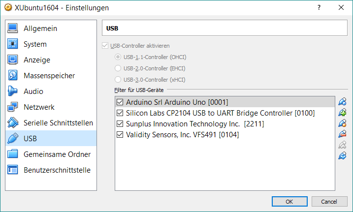

# Setup VMWare - Image

## Betriebssystem

XUbuntu 1604

## Installierte Software

- Arduino IDE 1.8 inkl. 
	- Huzzah-Bibliothek
	- I2C-Display
	- FaBoLCD_PCF8574
- MySql-Server (root, arduino)
- Apache Webserver, phpmyadmin

- PyCharm

## Netzwerk-Setup

* Adapter1: NAT --> Erreichbarkeit von Aussen, Internet
* Adapter2: "Bridged" für LAN Anschluss (intern mit fixer IP) für Arduino

## USB-Portkonfiguration

Um mit der Arduino-IDE aus der VMWare auf die Mikrocontroller zugreifen zu können, müssen die Geräte in der VMWare-Konfiguration freigegeben werden:

