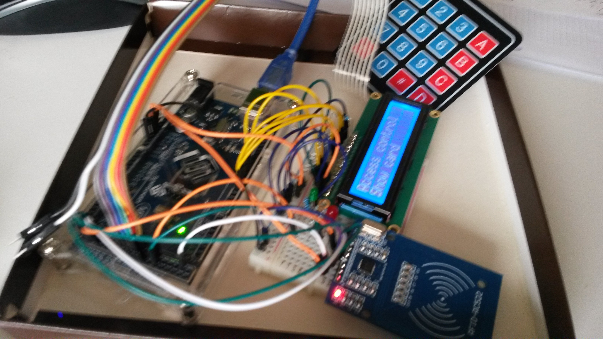

# Projekte

## Raumtemperatur/Feuchtigkeitsüberwachung mit Remote-Logging & Alarm *
- Lüfter anschalten bei Übertemperatur (mc-kontrolliert)
- Raumluft-Qualität messen
- U/I Monitoring
	- Spannung+Strom für 5/12V Strecke im PC messen
	- Ausgabe auf Display

## Webserver-basiertes Monitoring (Nagios, grafische Anzeige) *
- Monitoring (Nagios) visualisieren (z.B. Analoganzeige mit Servo)

## LORA - GPS Game *

## Heim-Automation
- Pflanzenbewässerung
- Licht/Temperatur/Zeitabhängige Rolladen/Heizungssteuerung
	
## kombinierte RFID und Zahlencode-basierte Zugangskontrolle *

- mit Remote-Logging & Remote-Deaktivierung
- Webserver-basiertes Monitoring (grafische Anzeige), z.B. Webcam aktivieren bei falscher Pin-Eingabe oder nicht vorhandener RFID
- optional: Einmalcodes vom Server

## Multiplayer - Game *
- mit Gyroskop-WLAN Things (alà Wii)
- Robigame via GameServer 
- Force-Feedback (mobile vibration stuff)

## Projektarbeit (2. Semester)
- es bestehen elementare Vorkenntnisse über HTTP (M101)
- Projekte siehe oben, allenfalls Remote-Logging unter Nutzung vorhandener IoT-Webplattformen, z.B. [https://dweet.io/](https://dweet.io/)

## Fachbereichsübergreifende Projektarbeit (4. Semester)

**Ziel:** Die Lernenden erstellen in Zweier/Dreier-Gruppen ein WIFI-basiertes Netzwerk mit "intelligenten" 
Sensoren/Aktoren und Webserver-basierten Daten-Logging / Monitoring zur Anwendung und Vertiefung der theoretischen Kenntnisse über Mikrocontroller.

**Vorkentnisse:** Die Lernenden (API und SYS) haben Vorkentnisse in folgenden Themen:

- HTML, PHP, JS (API)
- Netzwerke (WiFi) einrichten (SYS)
- Webserver und Datenbankserver betreiben (API/SYS)
- Strom und Spannungen messen (Modul ??)

## Durchführung

TODO elaborate...
